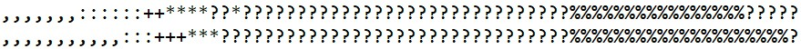

# ImageToASCIIConverter

Website allows to convert images to a txt document that is containing ASCII symbols and in low scale represent the same image.

Made with the use of Flask framework.

  
  
  

  
 

